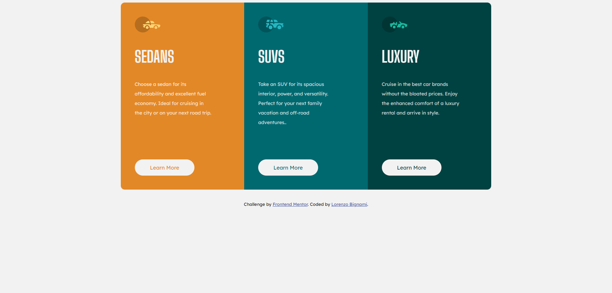

# Frontend Mentor - 3-column preview card component solution

This is a solution to the [3-column preview card component challenge on Frontend Mentor](https://www.frontendmentor.io/challenges/3column-preview-card-component-pH92eAR2-). Frontend Mentor challenges help you improve your coding skills by building realistic projects. 

## Table of contents

- [Overview](#overview)
  - [The challenge](#the-challenge)
  - [Screenshot](#screenshot)
- [My process](#my-process)
  - [Built with](#built-with)
  - [What I learned](#what-i-learned)
  - [Continued development](#continued-development)
  - [Useful resources](#useful-resources)
- [Author](#author)

**Note: Delete this note and update the table of contents based on what sections you keep.**

## Overview

### The challenge

Users should be able to:

- View the optimal layout depending on their device's screen size
- See hover states for interactive elements

### Screenshot

## My process

1 - Setting the general HTML layout 
2 - Building the layout styling using Scss 
3 - Adding modules for specific parts of the project 

### Built with

- Semantic HTML5 markup
- CSS custom properties
- Flexbox
- CSS Grid
- Mobile-first workflow

### What I learned

This is my first challenge.
I've learnt that is better to start doing something rather then doing nothing.
Yes... that's mainstream but is true. 

### Continued development

#Future ideas 📝
- Revise Scss rules to reduce the aoumnt of .scss files and make them more dinamic
- Make the layout using Grid instead 

#Still need patience on these 😑
- Media queries 
- css units 
- Responsive Design 

### Useful resources

- [W3school](https://www.w3schools.com/) - Had a look here to review how to code some of the styling and responsive details.

## Author

- Frontend Mentor - [@LorenzDev00](https://www.frontendmentor.io/profile/LorenzDev00)

